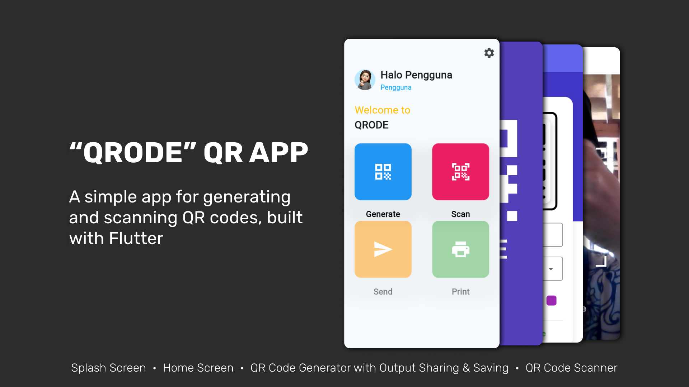
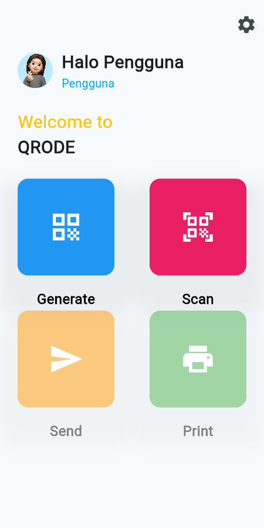
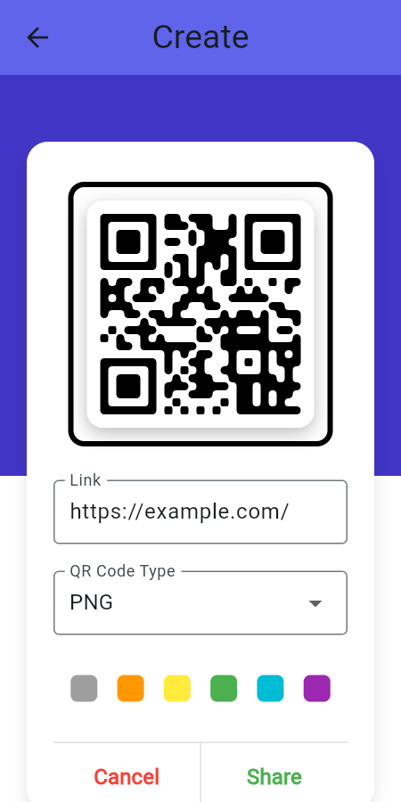
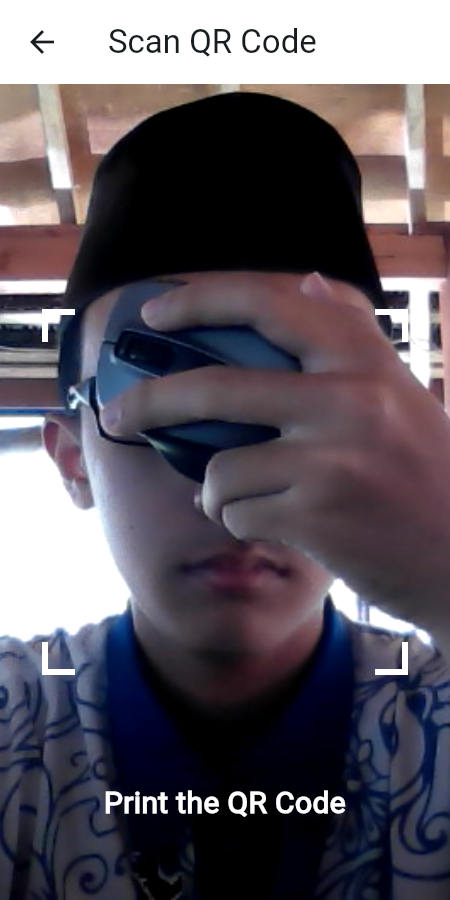

Thanks to [localbu](https://github.com/localbu) for the reference ([qr_code_generator](https://github.com/localbu/qr_code_generator) ([commit 7efc372](https://github.com/localbu/qr_code_generator/tree/7efc372855c07c358615f8d55e0058aa0d868932)))
***

 

    

        
Splash Screen

        
    

    

        
Home Screen

        
    

    

        
Generator screen

        
    

    

        
Scanner Screen (it opens camera)

        
    

